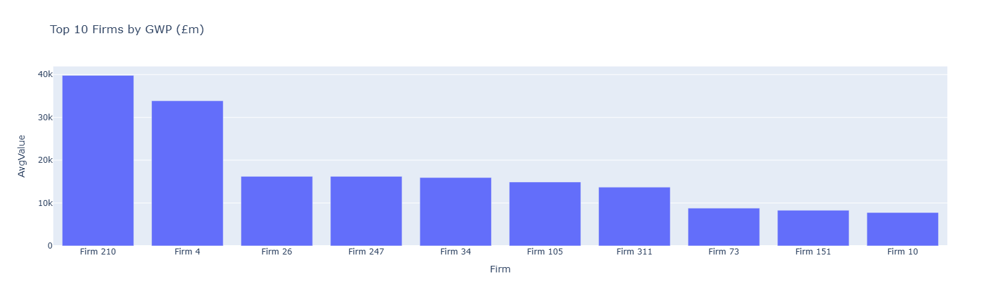
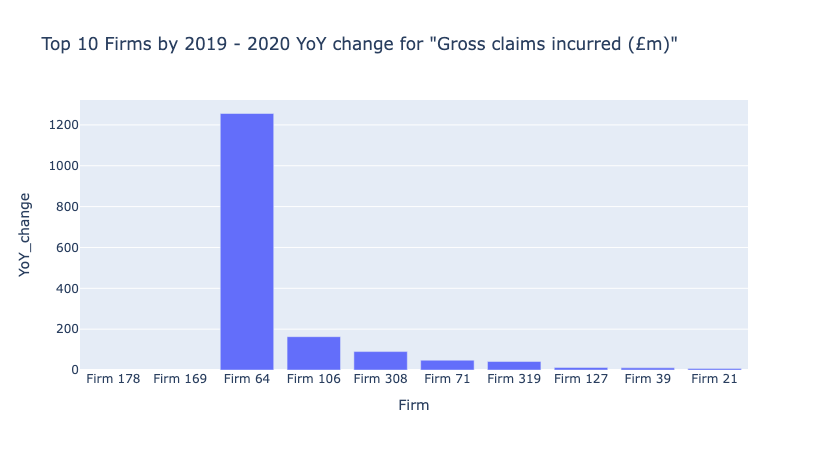
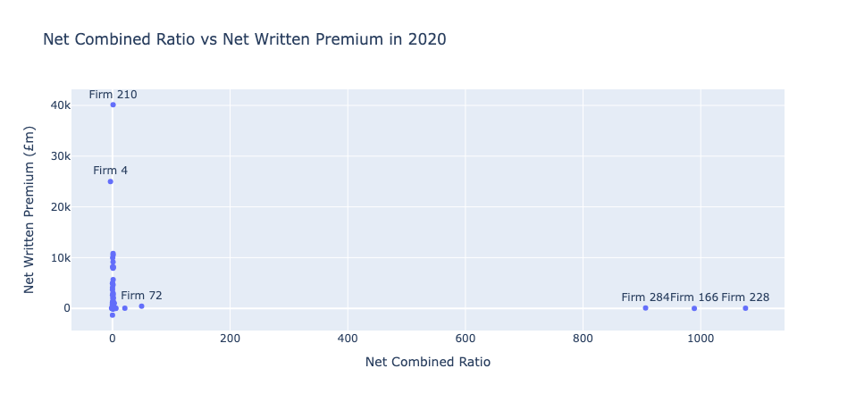
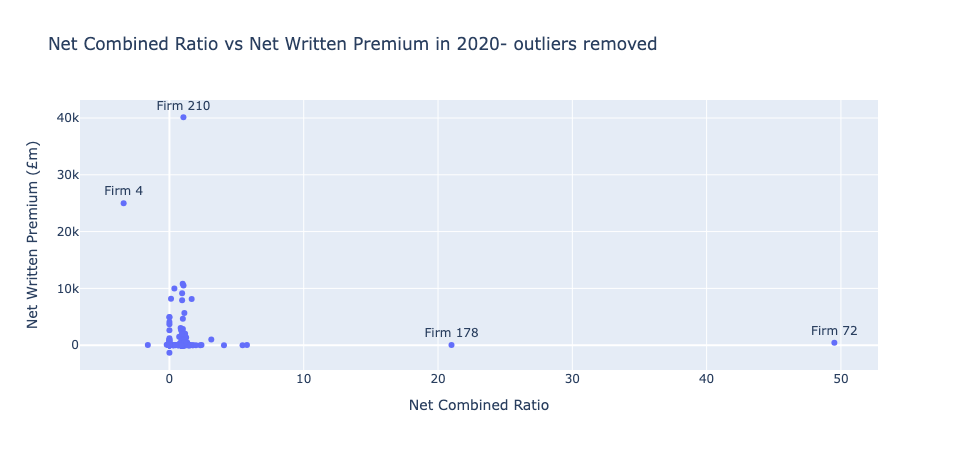

# Report: Prioritising Insurance Supervision Resource

This section report contains recommendations for the Insurance Supervision Manager on resource allocation towards firms, based on some preliminary analysis performed on the dataset provided.

Code for this report can be found here: [https://github.com/ravitejadaita/insurance-supervision-analysis](https://github.com/ravitejadaita/insurance-supervision-analysis)

## Data Cleaning
The following steps were undertaken to clean the data:
- From the 'General' sheet, firms (rows) that had all 0's were dropped.
- From the 'Underwriting' sheet, firms (rows) that had all 0's were dropped.
- This resulted in 306 rows in the 'General' sheet, and 243 rows in the 'Underwriting' sheet, each row corresponding to a single firm. Initially, both sheets contained 325 firms.
- Following this inital step, we merge the original (wide-format) data across both sheets into a single pandas dataframe. This results in 226 unique firms for our analysis.
- Data finally pivoted to long format for easier comparisons and analysis. This results in data with 4 columns - 'Firm', 'Year', 'Metric' and 'Value'. See a sample below:

| Firm   | Year | Metric                     | Value |
| ------ | ---- | -------------------------- | ----- |
| Firm 2 | 2016 | Gross claims incurred (£m) | 39.24 |
| Firm 2 | 2017 | Gross claims incurred (£m) | 35.95 |
| Firm 2 | 2018 | Gross claims incurred (£m) | 29.00 |
| Firm 2 | 2019 | Gross claims incurred (£m) | 0.00  |

## Prioritisation Methodology

I explore some possible approaches to prioritise which firms get the most attention from supervisors.
These have been broken down into categories that follow.
### Largest firms, based on Gross Written Premium (GWP)

 Since large firms are systemically important, it makes sense to monitor them in an ongoing fashion.
Taking the average GWP across the timespan in the data (2016-2020), we obtain the following chart:

 Based on this chart, firms to prioritise are: Firm 210, Firm 4, Firm 26, Firm 247 and Firm 34

### Volatility, based on year-on-year changes

 For volatility, I chose to pick 'Gross Claims Incurred' as my metric of choice - this is because it's a direct measure of a large cost to firms, impacting profitability and hence stability.

 Taking the 2019-2020 YoY change for Gross claims incurred as a measure of volatility, we observe the following:

 Based on this chart showing most volatile firms, I'd pick: Firm 64 as an outlier, and look at Firm 106, Firm 308, Firm 71 and Firm 319.

### Outliers, based on large differences to other firms

 We can look at the Net Written Premium vs Net Combined Ratio plot to identify inconsistencies for a given period of interest, say 2020YE.

    
    

Ideally, we'd want to look at firms where NCR>1 (not profitable), since this is an issue. We find that for the 2020 data, there are firms where NCR is close to 1000. In fact, if we zoom out in time, there are firms that have an NCR in the millions in 2017.

Based on the plots, we'd pick the following firms for prioritisation: Firm 228, Firm 166, Firm 284, Firm 72 and Firm 178

### Combined prioritisation score / rank

Another approach is to combine the methods above to obtain a single "rank" that helps prioritise where supervision resource allocation is needed. Here are 2 possible ways to achieve this:

- A simple formula that weights the firms using the fields above:

    **Combined Prioritisation Formula**

    A simple way to combine the factors is to use a weighted sum:

    **score = (a × size) + (b × volatility) + (c × outlier)**

    Where **a**, **b**, and **c** are weights assigned to each factor.

- For every y-o-y metric change, assign a rank from 1 to n, where n is the number of firms. This shows you for every metric, which firm has the highest y-o-y change. Use a simple weighted ranking approach that finds the firms that ranked highest the most across all metrics (had the largest yearly change), and use that weighted rank to prioritise where supervision resource is allocated.

## Errors and Outlier Analysis

In the section above, we have identified numerous outlier firms, based on difference from both historical reporting and comparison to peers.

By contrast, we haven't cleaned all errors. While a simple and naive approach of removing firms from analysis where reported values are all 0's across either of the sheets (General or Underwriting) is a step towards cleaner data, in practice this would involve clarifying with firms why data hasn't come through.

Errors can also take another form - for example, NWP (Net Written Premium) should not be greater than GWP, but for 2020YE, firms 7 and 131 show higher values. Similar checks across all other metrics should take precedence when identifying firms to prioritise in practice.

## Using Azure stack for the pipeline

This section of the report covers an idea of how this reporting process could be undertaken on the cloud, primarily focusing on Azure (and Azure Databricks) tooling.

### Pipeline steps, and tools

#### 1. Ingestion

- Use *Azure Data Factory* to ingest daily files (assume csv/excel) into *Azure Blob storage* or *Data Lake*. This makes the data accessible within Azure, and can be scheduled to run automatically. Alternatively, if data is accessible via APIs, use *Databricks Notebooks* or similar functionality to programmatically access, error check and ingest data daily.
- Main considerations: handles missed schedules, messy inputs

#### 2. Transformation and cleaning

- Use *Azure Databricks* (works well with Spark, for larger data) or simpler *Data Factory mapping flows* to apply the cleaning and transformation steps.
- Main considerations: performs reliably, logs steps for audit

#### 3. Storage

- Store historic and daily updating cleaned data, either in *Azure SQL*, or as parquet files on *Data lake* or *Blob* storage. This provides easier access for analysis tasks, without dealing with the cleaning and ingestion processes.
- Main considerations: inexpensive long-term storage, easy access for analysis

#### 4. Analysis (scheduled) & Visualisation

- Schedule the run of a *Databricks notebook*, or *Azure Functions* to compute the stats used within the report.
- Use *PowerBI* to visualise the stats, allow interactive exploration of the data and provide a dashboard for consumption.
- Main considerations: analytics interface easy to use for Data Scientists and Analysts, visualisation layer intuitive to use for non-technical audience

#### 5. Monitoring

- Pipeline health can also be tracked using built-in tools.
- Main considerations: clear metrics that are easy to understand

#### 6. Security & Governance

- Azure provides clear rule-based permissions and encryption allowing clear data lineage and compliance with the Bank's Privacy and FoI policies.
- Main considerations: well-defined policies, easy role assignment

### Use of Generative AI

We could leverage built-in tools on Azure to accelerate the development of an App or interface that provides supervisors with chatbot-like functionality.
> "User": "which firms had the largest GWP swing in 2020?"
>
> "Bot": "Firm x had the biggest drop. They also showed unstable behaviour in 2015."

The key step here is to summarise metrics from structured tables, into a format that can be retrieved using natural language via embeddings.

Theoretical steps to implement this:

1. Create a set of prompts, such as "which firms had the `{size_field}` `{direction_field}` `{metric_field}` in `{year_field}`" using mutable parameters.
1. Generate summaries for every firm using the yearly data as an input, using a standard prompt: "generate a summary for firm `{x}` using data provided `{data}`"
1. Link the summaries and prompt-set together in a database.
1. Create an app (can be a *Static Web App*) that allows this querying.
1. Use *Cognitive Search* or *Embeddings* to retrieve the best responses.
